# Linux Fundamentals for Data Engineering

Linux is one of the most important foundations for data engineering. Data pipelines often run on Linux servers, orchestration tools are usually deployed in Linux environments, and many core workflows depend on shell commands for file handling, log inspection, permissions, and remote access. A data engineer who understands Linux can move faster, troubleshoot more effectively, and work more confidently in production-like environments.

This article presents the fundamentals of Linux from a data engineering perspective and uses practical examples from my assignment, including SSH access to a remote server, directory navigation, file creation, search operations, permissions management, and file transfer with `scp`.

## Why Linux Matters in Data Engineering

Linux is not just an operating system; it is the working environment for many data platforms. In practice, a data engineer may need to connect to a server, inspect input files, move datasets between systems, examine logs, or set the correct access rights for shared resources. These tasks are often faster and more transparent in Linux than in graphical interfaces.

There are several reasons Linux is central to data engineering:

- Most cloud servers and virtual machines run Linux.
- Batch jobs, ETL scripts, and orchestration tools commonly run from the command line.
- Logs and configuration files are easier to inspect using shell tools.
- File permissions and ownership are critical in multi-user environments.
- Remote file transfer and server administration are more efficient through Linux utilities.

In other words, Linux is part of the daily toolkit for anyone building or maintaining data infrastructure.

## Connecting to a Remote Server

One of the first skills in my assignment was connecting to a remote Linux server using SSH. The server address I used was `159.65.222.96`, and I connected on port `22`, which is the standard SSH port.

SSH stands for Secure Shell. It allows you to open a secure terminal session on another machine over a network. For data engineers, SSH is essential because many workloads run on remote infrastructure rather than on a local laptop.

Example:

```bash
ssh username@159.65.222.96
```

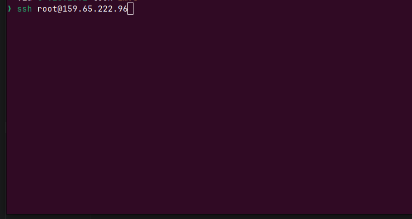

If the server uses a custom port, the connection can be written like this:

```bash
ssh -p 22 username@159.65.222.96
```

In my assignment, SSH was the starting point for every other task. Once connected, I could inspect directories, create folders, and move files within the server.


## Understanding the File System

Linux uses a hierarchical file system. Everything is organized under the root directory `/`, and navigation happens through paths. This structure matters in data engineering because pipelines often read from and write to specific folders such as staging areas, logs, scripts, backups, and output directories.

Two basic commands are especially important:
```bash
pwd
ls
```
- `pwd` shows the current working directory.
- `ls` lists files and folders in the current directory.

In my assignment, I first used `pwd` to confirm where I was in the file system, and then used `ls` to see the available directories on the server.

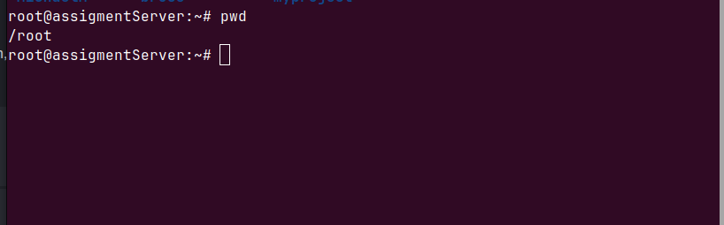
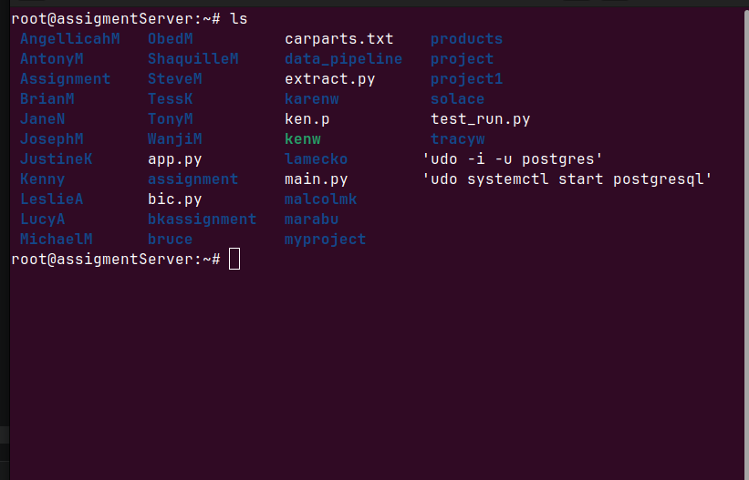

Example:

```bash
pwd
ls
```

This is a simple but important habit. Before changing or copying any file, a data engineer should always know the current location. Mistakes in path handling can lead to overwriting the wrong file or placing outputs in the wrong folder.

## Moving Around the System

The `cd` command changes directories. It is one of the most frequently used commands in Linux because data work usually involves moving between project folders, data directories, and log locations.

In the assignment, I changed into my directory, `MichaelM`, and later created another directory called `ImaniM`.
- `cd` → Change directory  
- `mkdir` → Create a directory  

Example:

```bash
cd MichaelM
```

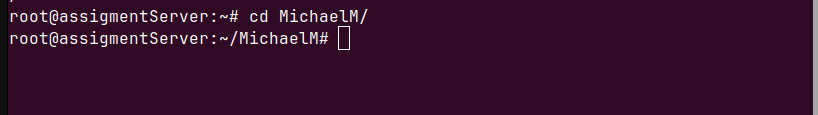

```bash
mkdir ImaniM
```

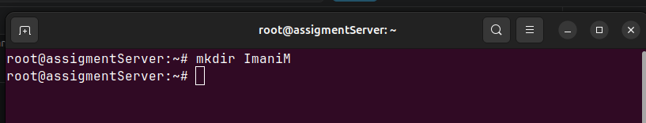

```bash
cd ImaniM
```


This workflow reflects a common data engineering pattern: navigate into a workspace, create a project folder, and organize related files in a structured way.

Good directory management helps keep pipelines maintainable. For example, you may separate raw data, processed data, scripts, and output into different folders so that each stage of the workflow is easy to understand.

## Creating, Copying, Renaming, and Removing Files

File management is a core Linux skill because data engineers constantly work with logs, CSV files, JSON files, SQL scripts, and configuration files.

The assignment included several common file operations:

- `touch` creates an empty file.
- `cp` copies files or directories.
- `mv` moves or renames files.
- `rm` removes files or directories.

Example:

```bash
touch main.txt
```

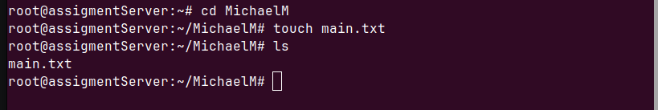

```bash
cp extract.py MichaelM/
```

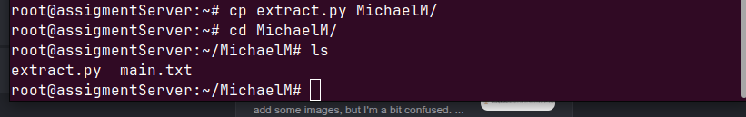

```bash
mv ../MichaelM/extract.py .
```

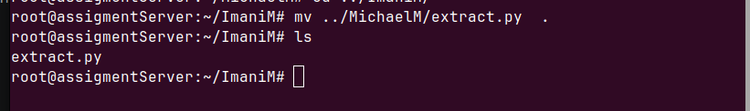

```bash
rm extract.py
```

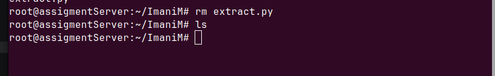

These commands may look basic, but they are extremely important in a real data workflow. For instance, a pipeline might generate a log file that needs to be archived, renamed by date, or removed after validation. The better you understand these operations, the easier it becomes to manage data assets safely.

One rule is especially important: always double-check what you are deleting with `rm`, because deletions are usually permanent unless you have a backup or version control system in place.

## Reading and Inspecting File Content

Data engineers frequently need to inspect the content of files without opening them in a graphical editor. Linux provides several commands for this:

- `cat` displays the whole file.
- `less` opens a file page by page.
- `head` shows the first lines of a file.
- `tail` shows the last lines of a file.
- `tail -f` follows a file as new lines are added.

In my assignment, I used `cat`, `less`, `head`, and `tail -f` to examine text output and monitor files. I also used `echo` to print text quickly while testing commands.

Examples:

```bash
cat main.tx
```

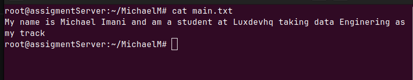

```bash
less main.tx
```

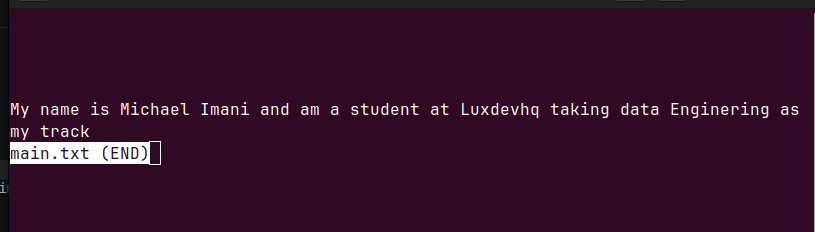

```bash
head -n 5 extract.py
```

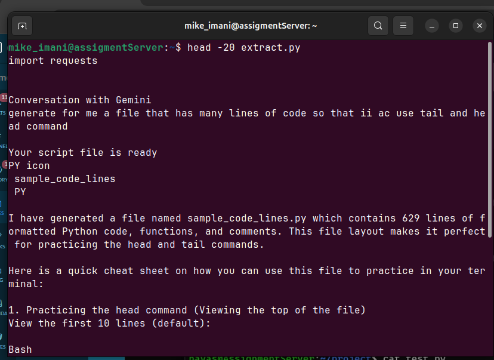

```bash
tail -f extract.py
```

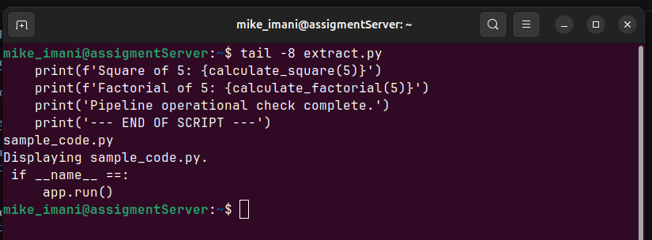

```bash
echo "Am a data Engineering student at luxdev"
```

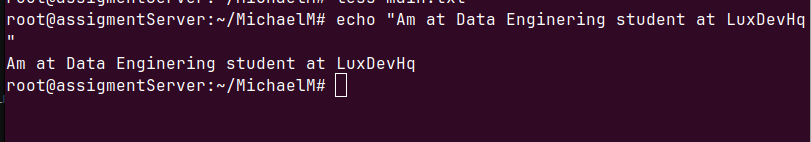

These commands are especially useful in data engineering because many problems can be diagnosed directly from file content. For example, if a pipeline fails, the last lines of a log file often reveal the error. If a file is too large to open comfortably, `head` and `tail` let you inspect just the part you need.

## Searching for Information Efficiently

Searching is one of the most valuable Linux skills for data engineers. Instead of reading entire files line by line, you can use tools that find exact matches or locate files based on rules.

The assignment included:

- `grep` to search text inside files.
- `grep -c` to count matching lines.
- `find` to search for files by name, type, or date.

Examples:

```bash
grep "print" extract.py
```

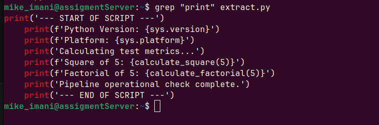

```bash
grep -c  "print" extract.py
```

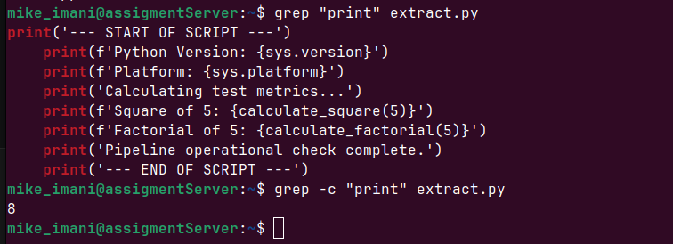

```bash
find .  "*.txt"
```

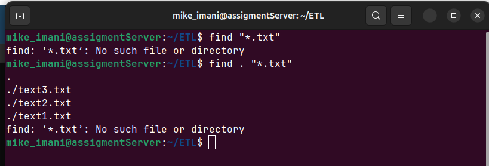

These commands are practical in real projects. Suppose a data load job fails during the night. You can use `grep` to search logs for the word `error`, or `grep -c` to count how many times a specific event occurred. If you do not know where a file is stored, `find` can quickly locate it.

This kind of fast searching reduces debugging time and helps you work more precisely.

## Managing Users and Permissions

Linux is a multi-user operating system, so permissions matter. In shared environments, data engineers must often ensure that the right people and services can access the right files.

The assignment covered several important commands. Each one is shown below with its screenshot.
 - `whoami` → Show current username  

```bash
whoami
```

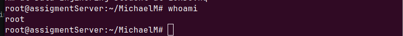


 `groups` → Show user groups  
 
```bash
groups
```

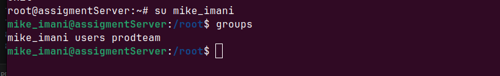

```bash
chmod u+x extract.py
```

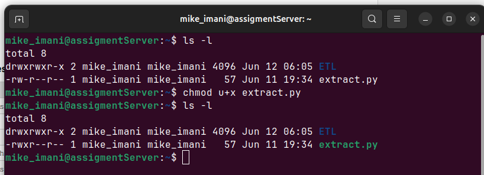

```bash
 sudo chown MichaelM:mike_imani /home/mike_imani/extract.py

```

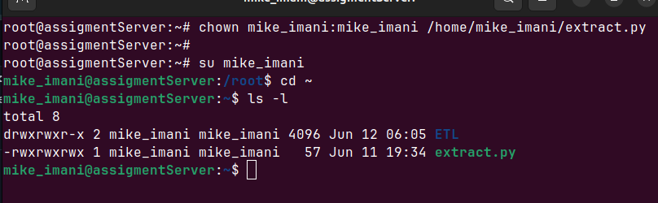

```bash
chgroup mike_imani:MichaelM /home/mike_imani/extract.py
```

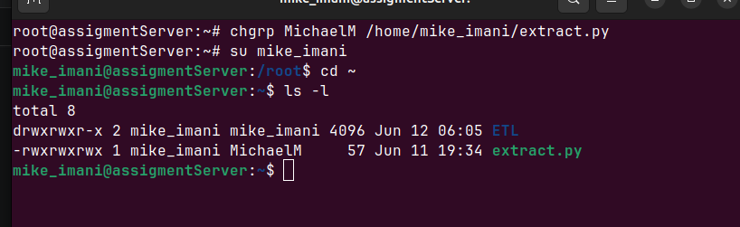

- `useradd` → used to add a new user

```bash
useradd imani_1
```

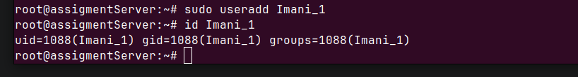

- `userdel` → used to delete the user account

```bash
userdel imani_1
```

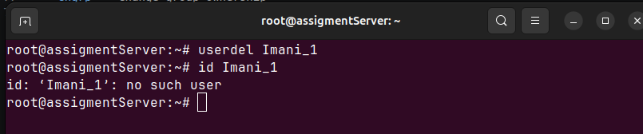


- `su` → used to change account usser  

```bash
su newuser
```

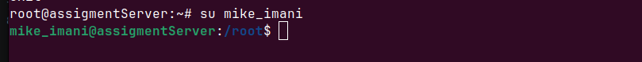

In a data engineering environment, permissions are not optional. A pipeline may run under a service account, raw files may belong to one user, and processed outputs may need access from another team. If permissions are too strict, jobs fail. If they are too open, sensitive data can be exposed.

Understanding ownership and access control is therefore essential for both reliability and security.

## Starting and Ending Sessions

Two additional basic commands from the assignment were `clear` and `exit`.

- `clear` cleans the terminal screen.
- `exit` closes the current shell session.

Examples:

```bash
clear
exit
```

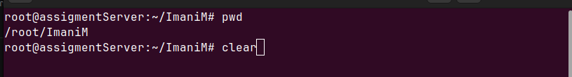
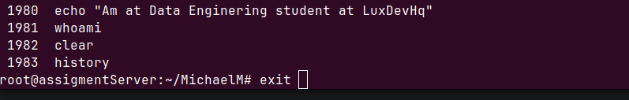

These commands are simple, but they improve workflow. `clear` helps keep the terminal readable during long sessions, while `exit` is the proper way to end a remote SSH session when you are done working.

## Practical Assignment Examples

My assignment brought these Linux fundamentals together in a realistic workflow. I first connected to the remote server through SSH, confirmed my working location with `pwd`, and listed contents with `ls`. I then navigated into my directory, created a new folder, and used file management commands like `touch`, `cp`, `mv`, and `rm` to organize content.

Later, I inspected file contents with `cat`, `less`, `head`, and `tail -f`. I searched inside files with `grep` and `grep -c`, and I used `find` to locate files. For permissions and user management, I explored `whoami`, `groups`, `chmod`, `chown`, `chgrp`, `sudo`, `useradd`, `userdel`, and `su`. Finally, I used `scp` to transfer files between my local computer and the server.

The `scp` command was especially useful because data engineers often need to move datasets and scripts between systems.

Examples:

```bash
scp /home/michael/Downloads/sample_code.go mike_imani@159.65.222.96:/home/mike_imani/ETL/\n


```

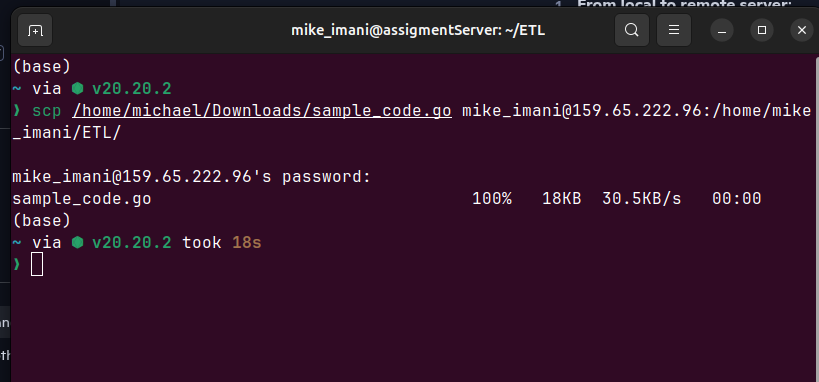

```bash
scp mike_imani@159.65.222.96:/home/mike_imani/ETL/sample_code.go /Users/michael/Downloads/

```
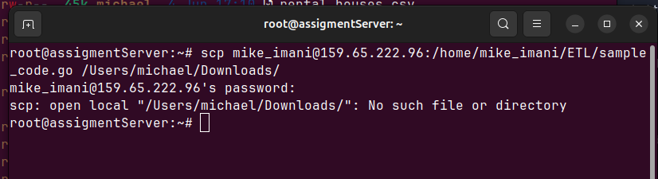

In practice, `scp` supports two common workflows:

- transferring files from a local PC to a server
- transferring files from a server back to a local PC

This is a real-world skill because data work frequently involves moving files into environments where jobs run, or retrieving results after processing.

## Best Practices for Data Engineers Using Linux

Knowing commands is only part of the job. Good Linux habits make your work safer and more professional.

- Use clear directory structures for scripts, logs, raw data, and outputs.
- Check your location before running destructive commands.
- Use `grep`, `head`, and `tail` before opening large files in an editor.
- Understand ownership and permissions before sharing data files.
- Prefer remote access tools like SSH and `scp` for reproducible workflows.
- Keep a history of commands so you can repeat successful steps later.

These habits reduce mistakes and improve consistency, especially when working on team-based data platforms.

## Conclusion

Linux fundamentals are a practical requirement for data engineering. Commands such as `ls`, `cd`, `mkdir`, `grep`, `find`, `chmod`, `ssh`, and `scp` form the everyday toolkit for navigating systems, managing files, reading logs, transferring data, and controlling access.

My assignment demonstrated these skills in a hands-on way: I connected to a server, explored the file system, created and managed files, inspected content, searched for data, handled permissions, and transferred files between systems. These are not just beginner commands; they are the building blocks of efficient and reliable data engineering work.

Once these fundamentals become natural, it becomes much easier to move on to scripting, automation, orchestration, and production data pipelines.


